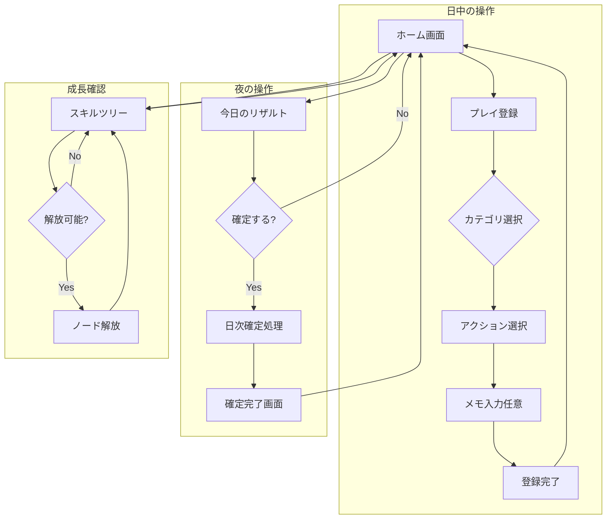

# Architecture

本ドキュメントは、Life Game RPG のシステムアーキテクチャを定義する。

---

## 1. システム概要

### コンセプト

人生の行動を「プレイ」として記録し、日次リザルトで確定 → スキルポイント（SP）を獲得 →
カテゴリ別の称号・スキルツリーを成長させる **人生RPG型システム**。

### 設計思想（spec 14章より）

> - 継続できることより「触りたくなること」を優先
> - 行動量ではなく「状態」を評価する
> - 停滞は失敗ではなくランク変動という仕様
> - 人生を"攻略対象"として扱う

これらの思想に基づき、以下を重視する:

1. **成長の即時フィードバック** - プレイ登録時に未確定XPを即座に表示
2. **中長期継続に耐える設計** - 確定後は不変、履歴が積み重なる
3. **ユーザー主導** - カテゴリ/アクションはカスタマイズ前提
4. **停滞が「失敗」ではない** - 週ランク称号で変動を可視化

---

## 2. 技術スタック

| レイヤー | 技術 | バージョン | 備考 |
|----------|------|------------|------|
| Framework | Next.js | 16.1.3 | App Router使用 |
| UI | React | 19.x | Server Components活用 |
| Language | TypeScript | 5.x | 型安全 |
| ORM | Prisma | 6.x | 型生成、マイグレーション |
| Database | PostgreSQL | 17.x | 本番環境 |
| Styling | Tailwind CSS | 4.x | ユーティリティファースト |

### spec との差異：永続化方針

| 観点 | spec の想定 | 実装 | 理由 |
|------|-------------|------|------|
| 永続化 | IndexedDB（クライアントサイド） | PostgreSQL（サーバーサイド） | Server Components/API Routesとの親和性、データ堅牢性 |
| 同期 | オフラインファースト | オンライン前提 | Phase 1 ではシンプルさ優先 |
| 認証 | なし（ローカル） | なし（シングルユーザー） | 将来的にマルチユーザー対応予定 |

---

## 3. システム構成図

```
┌─────────────────────────────────────────────────────────────┐
│                        Client (Browser)                      │
│  ┌──────────────────────────────────────────────────────┐   │
│  │              React Server Components                  │   │
│  │  ┌────────────┐ ┌────────────┐ ┌────────────────┐   │   │
│  │  │   Home     │ │  PlayLog   │ │  SkillTree     │   │   │
│  │  │   Page     │ │   Page     │ │   Page         │   │   │
│  │  └────────────┘ └────────────┘ └────────────────┘   │   │
│  └──────────────────────────────────────────────────────┘   │
│                            │                                 │
│                     Server Actions                           │
│                            │                                 │
└────────────────────────────┼─────────────────────────────────┘
                             │
┌────────────────────────────┼─────────────────────────────────┐
│                      Next.js Server                          │
│  ┌──────────────────────────────────────────────────────┐   │
│  │                  API Routes / Actions                 │   │
│  │  ┌────────────┐ ┌────────────┐ ┌────────────────┐   │   │
│  │  │ /api/play  │ │/api/result │ │ /api/skill     │   │   │
│  │  └────────────┘ └────────────┘ └────────────────┘   │   │
│  └──────────────────────────────────────────────────────┘   │
│                            │                                 │
│  ┌──────────────────────────────────────────────────────┐   │
│  │                  Prisma Client                        │   │
│  └──────────────────────────────────────────────────────┘   │
│                            │                                 │
└────────────────────────────┼─────────────────────────────────┘
                             │
                    ┌────────┴────────┐
                    │   PostgreSQL    │
                    │   Database      │
                    └─────────────────┘
```

---

## 4. 画面フロー



### 画面一覧（Phase 1）

| 画面 | パス | 説明 |
|------|------|------|
| ホーム | `/` | ダッシュボード。今日の進捗、カテゴリ別状態 |
| プレイ登録 | `/play` | カテゴリ→アクション選択→登録 |
| リザルト | `/result` | 今日のプレイ一覧、確定ボタン |
| スキルツリー | `/skills` | カテゴリ別ツリー表示、ノード解放 |

---

## 5. ドメイン境界

### 5.1 Play Domain（プレイ記録）

プレイの定義と記録を管理する。

**モデル:**
- `Category` - プレイのカテゴリ分類
- `Action` - カテゴリ内の具体的行動定義
- `PlayLog` - 個別プレイの記録

**責務:**
- カテゴリ/アクションの CRUD
- プレイログの作成・削除
- 確定後プレイの翌日回し判定

```typescript
// Play Domain の主要操作
interface PlayDomain {
  // カテゴリ
  getCategories(): Promise<Category[]>;
  createCategory(name: string): Promise<Category>;
  updateCategory(id: string, data: Partial<Category>): Promise<Category>;

  // アクション
  getActions(categoryId: string): Promise<Action[]>;
  createAction(categoryId: string, label: string): Promise<Action>;

  // プレイログ
  registerPlay(actionId: string, note?: string): Promise<PlayLog>;
  deletePlay(playLogId: string): Promise<void>;
  getPlaysForDay(dayKey: string): Promise<PlayLog[]>;
}
```

### 5.2 Result Domain（日次集計）

日次リザルトの状態管理と確定処理を担当。

**モデル:**
- `DailyResult` - 日単位の確定状態管理
- `DailyCategoryResult` - 日×カテゴリ単位の集計結果

**責務:**
- 日次リザルトの状態遷移（draft → confirmed）
- XP/SP の計算と反映
- 確定処理のトランザクション管理

```typescript
// Result Domain の主要操作
interface ResultDomain {
  getDailyResult(dayKey: string): Promise<DailyResult | null>;
  getDailyCategoryResults(dayKey: string): Promise<DailyCategoryResult[]>;
  confirmDay(dayKey: string): Promise<void>;
  canConfirm(dayKey: string): Promise<boolean>;
}
```

### 5.3 Growth Domain（成長システム）

恒久称号と週ランク称号を管理。

**モデル:**
- `SkillTree` - 恒久称号のツリー定義
- `SkillNode` - ツリー内の個別ノード
- `UnlockedNode` - 解放済みノードの記録
- `SeasonalTitle` - 週ランク称号の定義

**責務:**
- スキルツリー/ノードの定義管理
- ノード解放可否の判定
- ノード解放処理
- 週ランク称号の判定

```typescript
// Growth Domain の主要操作
interface GrowthDomain {
  // スキルツリー
  getSkillTrees(categoryId: string): Promise<SkillTree[]>;
  getSkillNodes(treeId: string): Promise<SkillNode[]>;

  // ノード解放
  canUnlock(nodeId: string): Promise<{ canUnlock: boolean; reason?: string }>;
  unlockNode(nodeId: string): Promise<void>;
  getUnlockedNodes(treeId: string): Promise<UnlockedNode[]>;

  // 週ランク称号
  getCurrentSeasonalTitle(categoryId: string): Promise<SeasonalTitle | null>;
  getSeasonalTitles(categoryId: string): Promise<SeasonalTitle[]>;
}
```

### 5.4 Player Domain（プレイヤー状態）

プレイヤーのカテゴリ別状態と消費履歴を管理。

**モデル:**
- `PlayerCategoryState` - カテゴリ別の累計XP・未使用SP
- `SpendLog` - SP消費履歴

**責務:**
- プレイヤー状態の取得・更新
- SP消費履歴の記録
- 統計情報の算出

```typescript
// Player Domain の主要操作
interface PlayerDomain {
  getPlayerState(categoryId: string): Promise<PlayerCategoryState | null>;
  getAllPlayerStates(): Promise<PlayerCategoryState[]>;
  getSpendLogs(categoryId: string): Promise<SpendLog[]>;
  getTotalStats(): Promise<{
    totalXp: number;
    totalSpEarned: number;
    totalSpSpent: number;
  }>;
}
```

### ドメイン間の依存関係

```
┌──────────────┐     ┌──────────────┐
│ Play Domain  │────▶│Result Domain │
└──────────────┘     └──────────────┘
        │                   │
        │                   │
        ▼                   ▼
┌──────────────┐     ┌──────────────┐
│Player Domain │◀────│Growth Domain │
└──────────────┘     └──────────────┘
```

- **Play → Result**: プレイ登録時に DailyCategoryResult を更新
- **Result → Player**: 確定時に PlayerCategoryState を更新
- **Growth → Player**: ノード解放時に SP を消費

---

## 6. ユースケース一覧

### UC-01: プレイ登録

| 項目 | 内容 |
|------|------|
| アクター | ユーザー |
| 事前条件 | カテゴリ・アクションが存在 |
| 基本フロー | 1. カテゴリ選択 → 2. アクション選択 → 3. メモ入力（任意） → 4. 登録 |
| 事後条件 | PlayLog作成、DailyCategoryResult.playCount+1 |
| 代替フロー | 確定済み日の場合、翌日のdayKeyで登録 |

### UC-02: 日次確定

| 項目 | 内容 |
|------|------|
| アクター | ユーザー |
| 事前条件 | 対象日のDailyResultがdraft |
| 基本フロー | 1. リザルト画面表示 → 2. 確定ボタン押下 → 3. 確定処理実行 |
| 事後条件 | DailyResult.status=confirmed、PlayerCategoryState更新 |
| 代替フロー | 既に確定済みの場合、エラー表示 |

### UC-03: ノード解放

| 項目 | 内容 |
|------|------|
| アクター | ユーザー |
| 事前条件 | SP >= costSp、前提ノード解放済み |
| 基本フロー | 1. スキルツリー表示 → 2. 解放可能ノード選択 → 3. 解放確認 → 4. 解放処理 |
| 事後条件 | UnlockedNode作成、PlayerCategoryState.spUnspent減少、SpendLog作成 |
| 代替フロー | SP不足または前提未達の場合、解放不可表示 |

### UC-04: カテゴリ管理

| 項目 | 内容 |
|------|------|
| アクター | ユーザー |
| 事前条件 | なし |
| 基本フロー | 1. 設定画面 → 2. カテゴリ追加/編集/非表示 |
| 事後条件 | Category更新 |
| 代替フロー | 非表示時は関連データ保持（論理削除） |

### UC-05: 進捗確認

| 項目 | 内容 |
|------|------|
| アクター | ユーザー |
| 事前条件 | なし |
| 基本フロー | 1. ホーム画面表示 → 2. 今日の進捗確認 → 3. カテゴリ別状態確認 |
| 事後条件 | なし（参照のみ） |
| 表示内容 | 未確定XP、累計XP、未使用SP、現在の週ランク称号、解放済みノード |

---

## 7. ディレクトリ構成（予定）

```
life-game-rpg/
├── app/
│   ├── page.tsx              # ホーム画面
│   ├── play/
│   │   └── page.tsx          # プレイ登録
│   ├── result/
│   │   └── page.tsx          # リザルト画面
│   ├── skills/
│   │   └── page.tsx          # スキルツリー
│   ├── api/
│   │   ├── play/
│   │   │   └── route.ts      # プレイ関連API
│   │   ├── result/
│   │   │   └── route.ts      # リザルト関連API
│   │   └── skills/
│   │       └── route.ts      # スキル関連API
│   └── layout.tsx
├── components/
│   ├── ui/                   # 汎用UIコンポーネント
│   ├── play/                 # プレイ関連コンポーネント
│   ├── result/               # リザルト関連コンポーネント
│   └── skills/               # スキル関連コンポーネント
├── lib/
│   ├── prisma.ts             # Prismaクライアント
│   ├── domains/
│   │   ├── play.ts           # Play Domain
│   │   ├── result.ts         # Result Domain
│   │   ├── growth.ts         # Growth Domain
│   │   └── player.ts         # Player Domain
│   └── utils/
│       ├── date.ts           # 日付ユーティリティ
│       └── calc.ts           # 計算ユーティリティ
├── prisma/
│   ├── schema.prisma
│   ├── seed.ts
│   └── migrations/
├── docs/
│   ├── spec_v1.0.md
│   ├── architecture.md       # 本ドキュメント
│   ├── data-model.md
│   ├── state-machine.md
│   ├── ux-spec.md
│   └── open-questions.md
└── public/
```

---

## 8. API設計（Phase 1）

### Play API

| Method | Endpoint | 説明 |
|--------|----------|------|
| GET | `/api/categories` | カテゴリ一覧取得 |
| POST | `/api/categories` | カテゴリ作成 |
| PATCH | `/api/categories/:id` | カテゴリ更新 |
| GET | `/api/actions?categoryId=` | アクション一覧取得 |
| POST | `/api/actions` | アクション作成 |
| POST | `/api/plays` | プレイ登録 |
| DELETE | `/api/plays/:id` | プレイ削除 |
| GET | `/api/plays?dayKey=` | 日別プレイ取得 |

### Result API

| Method | Endpoint | 説明 |
|--------|----------|------|
| GET | `/api/results/:dayKey` | 日次リザルト取得 |
| POST | `/api/results/:dayKey/confirm` | 日次確定 |

### Skills API

| Method | Endpoint | 説明 |
|--------|----------|------|
| GET | `/api/skills/trees?categoryId=` | スキルツリー一覧 |
| GET | `/api/skills/nodes?treeId=` | ノード一覧 |
| POST | `/api/skills/nodes/:id/unlock` | ノード解放 |
| GET | `/api/skills/seasonal-titles?categoryId=` | 週ランク称号一覧 |
| GET | `/api/skills/seasonal-titles/current?categoryId=` | 現在の週ランク |

### Player API

| Method | Endpoint | 説明 |
|--------|----------|------|
| GET | `/api/player/states` | 全カテゴリ状態 |
| GET | `/api/player/states/:categoryId` | カテゴリ別状態 |
| GET | `/api/player/spend-logs?categoryId=` | SP消費履歴 |

---

## 9. エラーハンドリング方針

### エラーレスポンス形式

```typescript
interface ErrorResponse {
  error: {
    code: string;
    message: string;
    details?: Record<string, unknown>;
  };
}
```

### エラーコード一覧

| コード | HTTPステータス | 説明 |
|--------|---------------|------|
| `NOT_FOUND` | 404 | リソースが存在しない |
| `ALREADY_CONFIRMED` | 400 | 既に確定済み |
| `INSUFFICIENT_SP` | 400 | SP不足 |
| `PREREQUISITE_NOT_MET` | 400 | 前提条件未達（ノード解放） |
| `VALIDATION_ERROR` | 400 | バリデーションエラー |
| `INTERNAL_ERROR` | 500 | サーバー内部エラー |

---

## 10. セキュリティ考慮事項

### Phase 1（シングルユーザー）

- 認証なし
- 全データはサーバー側PostgreSQLに保存
- SQLインジェクション対策: Prismaの型安全クエリ使用
- XSS対策: Reactの自動エスケープ

### 将来（マルチユーザー対応時）

- 認証システム導入（NextAuth.js等）
- 全モデルにuserId追加
- Row Level Security検討
- CSRF対策

---

## 更新履歴

| 日付 | 更新内容 |
|------|----------|
| 2026-01-19 | 初版作成 |
