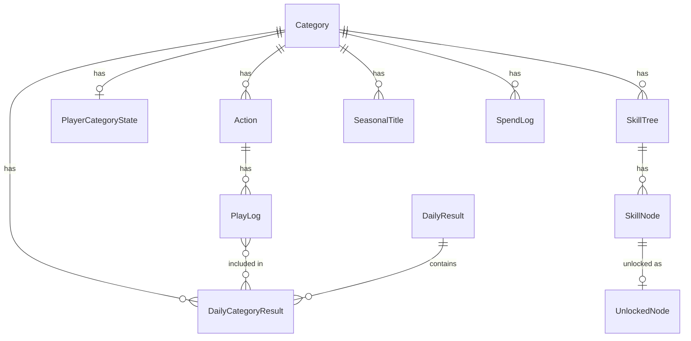

# Data Model

本ドキュメントは、Life Game RPG のデータモデル設計を定義する。
Prisma スキーマ（`prisma/schema.prisma`）と一致するよう管理する。

---

## ER図



---

## ドメイン別モデル分類

### Play Domain（プレイ記録）
- **Category**: プレイのカテゴリ分類
- **Action**: カテゴリ内の具体的行動定義
- **PlayLog**: 個別プレイの記録

### Result Domain（日次集計）
- **DailyResult**: 日単位の確定状態管理
- **DailyCategoryResult**: 日×カテゴリ単位の集計結果

### Growth Domain（成長システム）
- **SkillTree**: 恒久称号のツリー定義
- **SkillNode**: ツリー内の個別ノード（称号）
- **UnlockedNode**: 解放済みノードの記録
- **SeasonalTitle**: 週ランク称号の定義

### Player Domain（プレイヤー状態）
- **PlayerCategoryState**: カテゴリ別の累計XP・未使用SP
- **SpendLog**: SP消費履歴

---

## モデル詳細

### Category

プレイのカテゴリ分類。ユーザーが自由に作成・編集可能。

| カラム | 型 | 制約 | 説明 |
|--------|----|----|------|
| id | String | PK, cuid() | 一意識別子 |
| name | String | NOT NULL | カテゴリ名（例：「健康」） |
| visible | Boolean | DEFAULT true | 表示/非表示フラグ |
| order | Int | DEFAULT 0 | 表示順序 |
| rankWindowDays | Int | DEFAULT 7 | 週ランク判定期間（日数） |
| xpPerPlay | Int | DEFAULT 10 | 1プレイあたりの獲得XP |
| xpPerSp | Int | DEFAULT 20 | 1SP獲得に必要なXP |
| createdAt | DateTime | DEFAULT now() | 作成日時 |
| updatedAt | DateTime | @updatedAt | 更新日時 |

**リレーション:**
- `actions`: Action[] - 所属アクション一覧
- `dailyCategoryResults`: DailyCategoryResult[] - 日次集計結果
- `playerState`: PlayerCategoryState? - プレイヤー状態（1:1）
- `skillTrees`: SkillTree[] - スキルツリー一覧
- `seasonalTitles`: SeasonalTitle[] - 週ランク称号一覧
- `spendLogs`: SpendLog[] - SP消費履歴

**インデックス:**
- `@@index([visible, order])` - 表示順でのフィルタリング用

---

### Action

カテゴリ内の具体的行動定義。プレイ登録時に選択する。

| カラム | 型 | 制約 | 説明 |
|--------|----|----|------|
| id | String | PK, cuid() | 一意識別子 |
| categoryId | String | FK, NOT NULL | 所属カテゴリID |
| label | String | NOT NULL | アクション名（例：「筋トレ（上半身）」） |
| visible | Boolean | DEFAULT true | 表示/非表示フラグ |
| order | Int | DEFAULT 0 | 表示順序 |
| createdAt | DateTime | DEFAULT now() | 作成日時 |
| updatedAt | DateTime | @updatedAt | 更新日時 |

**リレーション:**
- `category`: Category - 所属カテゴリ
- `playLogs`: PlayLog[] - このアクションのプレイログ

**インデックス:**
- `@@index([categoryId, visible, order])` - カテゴリ内表示順フィルタリング用

**カスケード削除:**
- Category 削除時: この Action も削除

---

### PlayLog

個別プレイの記録。1プレイ = 1レコード。

| カラム | 型 | 制約 | 説明 |
|--------|----|----|------|
| id | String | PK, cuid() | 一意識別子 |
| at | DateTime | DEFAULT now() | プレイ登録時刻（実時刻） |
| dayKey | String | NOT NULL | 所属日（YYYY-MM-DD） |
| actionId | String | FK, NOT NULL | 実行アクションID |
| note | String? | - | 任意メモ |
| createdAt | DateTime | DEFAULT now() | 作成日時 |

**リレーション:**
- `action`: Action - 実行アクション
- `dailyCategoryResults`: DailyCategoryResult[] - 所属する日次集計（多対多）

**インデックス:**
- `@@index([dayKey])` - 日別検索用
- `@@index([actionId])` - アクション別検索用

**カスケード削除:**
- Action 削除時: この PlayLog も削除

**備考:**
- `at` と `dayKey` は異なる場合がある（確定後プレイの翌日回し時）
- `dayKey` は論理的な所属日、`at` は物理的な登録時刻

---

### DailyResult

日単位の確定状態管理。

| カラム | 型 | 制約 | 説明 |
|--------|----|----|------|
| dayKey | String | PK | 日付（YYYY-MM-DD） |
| status | String | DEFAULT "draft" | 状態（"draft" or "confirmed"） |
| confirmedAt | DateTime? | - | 確定日時（confirmedの場合のみ） |
| createdAt | DateTime | DEFAULT now() | 作成日時 |
| updatedAt | DateTime | @updatedAt | 更新日時 |

**リレーション:**
- `categoryResults`: DailyCategoryResult[] - カテゴリ別集計結果

**状態遷移:**
- `draft` → `confirmed`（不可逆）

詳細は [state-machine.md](./state-machine.md) を参照。

---

### DailyCategoryResult

日×カテゴリ単位の集計結果。

| カラム | 型 | 制約 | 説明 |
|--------|----|----|------|
| id | String | PK, cuid() | 一意識別子 |
| dayKey | String | FK, NOT NULL | 日付（YYYY-MM-DD） |
| categoryId | String | FK, NOT NULL | カテゴリID |
| playCount | Int | DEFAULT 0 | プレイ回数 |
| xpEarned | Int | DEFAULT 0 | 獲得XP |
| spEarned | Int | DEFAULT 0 | 獲得SP（確定時に計算） |
| createdAt | DateTime | DEFAULT now() | 作成日時 |
| updatedAt | DateTime | @updatedAt | 更新日時 |

**リレーション:**
- `dailyResult`: DailyResult - 所属する日次リザルト
- `category`: Category - 所属カテゴリ
- `playLogs`: PlayLog[] - 含まれるプレイログ（多対多）

**制約:**
- `@@unique([dayKey, categoryId])` - 同一日・同一カテゴリで重複不可

**インデックス:**
- `@@index([categoryId])` - カテゴリ別検索用

**カスケード削除:**
- DailyResult 削除時: この DailyCategoryResult も削除
- Category 削除時: この DailyCategoryResult も削除

**計算式:**
- `xpEarned = playCount × category.xpPerPlay`
- `spEarned = Math.floor(xpEarned / category.xpPerSp)`

---

### PlayerCategoryState

カテゴリ別のプレイヤー累計状態。

| カラム | 型 | 制約 | 説明 |
|--------|----|----|------|
| id | String | PK, cuid() | 一意識別子 |
| categoryId | String | FK, UNIQUE | カテゴリID（1:1） |
| xpTotal | Int | DEFAULT 0 | 確定済み累計XP |
| spUnspent | Int | DEFAULT 0 | 未使用SP残高 |
| createdAt | DateTime | DEFAULT now() | 作成日時 |
| updatedAt | DateTime | @updatedAt | 更新日時 |

**リレーション:**
- `category`: Category - 対象カテゴリ

**制約:**
- `categoryId` は UNIQUE（カテゴリとの1:1関係）

**カスケード削除:**
- Category 削除時: この PlayerCategoryState も削除

**更新タイミング:**
- 日次確定時: `xpTotal += xpEarned`, `spUnspent += spEarned`
- ノード解放時: `spUnspent -= costSp`

---

### SkillTree

恒久称号のツリー定義。カテゴリごとに複数持てる。

| カラム | 型 | 制約 | 説明 |
|--------|----|----|------|
| id | String | PK, cuid() | 一意識別子 |
| categoryId | String | FK, NOT NULL | 所属カテゴリID |
| name | String | NOT NULL | ツリー名（例：「健康マスター」） |
| visible | Boolean | DEFAULT true | 表示/非表示フラグ |
| order | Int | DEFAULT 0 | 表示順序 |
| createdAt | DateTime | DEFAULT now() | 作成日時 |
| updatedAt | DateTime | @updatedAt | 更新日時 |

**リレーション:**
- `category`: Category - 所属カテゴリ
- `skillNodes`: SkillNode[] - ツリー内ノード一覧

**インデックス:**
- `@@index([categoryId, visible, order])` - カテゴリ内表示順フィルタリング用

**カスケード削除:**
- Category 削除時: この SkillTree も削除

---

### SkillNode

ツリー内の個別ノード（恒久称号の各段階）。

| カラム | 型 | 制約 | 説明 |
|--------|----|----|------|
| id | String | PK, cuid() | 一意識別子 |
| treeId | String | FK, NOT NULL | 所属ツリーID |
| order | Int | NOT NULL | ツリー内順序（1始まり） |
| title | String | NOT NULL | 称号名（例：「健康への目覚め」） |
| costSp | Int | NOT NULL | 解放に必要なSP |
| createdAt | DateTime | DEFAULT now() | 作成日時 |
| updatedAt | DateTime | @updatedAt | 更新日時 |

**リレーション:**
- `tree`: SkillTree - 所属ツリー
- `unlockedNodes`: UnlockedNode[] - 解放記録

**制約:**
- `@@unique([treeId, order])` - 同一ツリー内で順序は一意

**インデックス:**
- `@@index([treeId, order])` - ツリー内順序検索用

**カスケード削除:**
- SkillTree 削除時: この SkillNode も削除

**解放条件:**
- `order === 1`: 無条件で解放可能（SPが足りれば）
- `order > 1`: `order - 1` のノードが解放済みであること

---

### UnlockedNode

解放済みノードの記録。

| カラム | 型 | 制約 | 説明 |
|--------|----|----|------|
| id | String | PK, cuid() | 一意識別子 |
| nodeId | String | FK, UNIQUE | 解放したノードID |
| unlockedAt | DateTime | DEFAULT now() | 解放日時 |

**リレーション:**
- `node`: SkillNode - 解放したノード

**制約:**
- `@@unique([nodeId])` - 同一ノードは1回のみ解放可能

**カスケード削除:**
- SkillNode 削除時: この UnlockedNode も削除

---

### SeasonalTitle

週ランク称号（維持・変動型）の定義。

| カラム | 型 | 制約 | 説明 |
|--------|----|----|------|
| id | String | PK, cuid() | 一意識別子 |
| categoryId | String | FK, NOT NULL | 所属カテゴリID |
| label | String | NOT NULL | 称号名（例：「アスリート」） |
| minSpEarned | Int | NOT NULL | 必要な直近N日SP合計 |
| order | Int | DEFAULT 0 | 表示順序 |
| createdAt | DateTime | DEFAULT now() | 作成日時 |
| updatedAt | DateTime | @updatedAt | 更新日時 |

**リレーション:**
- `category`: Category - 所属カテゴリ

**インデックス:**
- `@@index([categoryId, order])` - カテゴリ内順序検索用

**カスケード削除:**
- Category 削除時: この SeasonalTitle も削除

**判定ロジック:**
```typescript
// 直近 N 日の SP 合計を取得
const recentSp = await getRecentSpEarned(categoryId, rankWindowDays);

// 条件を満たす最高ランクを取得
const title = seasonalTitles
  .filter(t => t.minSpEarned <= recentSp)
  .sort((a, b) => b.order - a.order)[0];
```

---

### SpendLog

SP消費履歴。監査・振り返り用。

| カラム | 型 | 制約 | 説明 |
|--------|----|----|------|
| id | String | PK, cuid() | 一意識別子 |
| at | DateTime | DEFAULT now() | 消費日時 |
| categoryId | String | FK, NOT NULL | 対象カテゴリID |
| type | String | NOT NULL | 消費種別（"unlock_node"） |
| costSp | Int | NOT NULL | 消費SP |
| refId | String | NOT NULL | 参照先ID（nodeId等） |
| dayKey | String? | - | 関連日付（任意） |
| createdAt | DateTime | DEFAULT now() | 作成日時 |

**リレーション:**
- `category`: Category - 対象カテゴリ

**インデックス:**
- `@@index([categoryId, at])` - カテゴリ別時系列検索用

**カスケード削除:**
- Category 削除時: この SpendLog も削除

**type の種類:**
- `"unlock_node"`: スキルノード解放

---

## インデックス設計一覧

| モデル | インデックス | 用途 |
|--------|-------------|------|
| Category | `[visible, order]` | 表示順一覧取得 |
| Action | `[categoryId, visible, order]` | カテゴリ内アクション一覧 |
| PlayLog | `[dayKey]` | 日別プレイログ取得 |
| PlayLog | `[actionId]` | アクション別集計 |
| DailyCategoryResult | `[categoryId]` | カテゴリ別集計取得 |
| SkillTree | `[categoryId, visible, order]` | カテゴリ内ツリー一覧 |
| SkillNode | `[treeId, order]` | ツリー内ノード順序取得 |
| SeasonalTitle | `[categoryId, order]` | カテゴリ内称号一覧 |
| SpendLog | `[categoryId, at]` | カテゴリ別消費履歴 |

---

## カスケード削除の影響範囲

```
Category を削除すると:
├── Action が削除
│   └── PlayLog が削除
├── DailyCategoryResult が削除
├── PlayerCategoryState が削除
├── SkillTree が削除
│   └── SkillNode が削除
│       └── UnlockedNode が削除
├── SeasonalTitle が削除
└── SpendLog が削除
```

**注意:** Category の物理削除は履歴データの喪失を伴うため、通常は `visible=false` による論理削除を推奨。

---

## シードデータ定義

### カテゴリ（2件）

| ID | 名前 | 順序 |
|----|------|------|
| health-category | 健康 | 1 |
| certification-category | 資格・学習 | 2 |

### アクション（10件）

**健康カテゴリ:**
| ID | ラベル | 順序 |
|----|--------|------|
| health-1 | 筋トレ（上半身） | 1 |
| health-2 | 筋トレ（下半身） | 2 |
| health-3 | 有酸素運動（30分以上） | 3 |
| health-4 | ストレッチ | 4 |
| health-5 | 早寝早起き | 5 |

**資格・学習カテゴリ:**
| ID | ラベル | 順序 |
|----|--------|------|
| cert-1 | 教材・参考書学習 | 1 |
| cert-2 | オンライン講座視聴 | 2 |
| cert-3 | 問題演習 | 3 |
| cert-4 | 模擬試験 | 4 |
| cert-5 | 復習・まとめ作成 | 5 |

### スキルツリー（2件）

| ID | カテゴリ | 名前 |
|----|----------|------|
| health-skill-tree | 健康 | 健康マスター |
| cert-skill-tree | 資格・学習 | 知識の探求者 |

### スキルノード（10件）

**健康マスター:**
| ID | 称号 | コスト | 順序 |
|----|------|--------|------|
| health-node-1 | 健康への目覚め | 1 SP | 1 |
| health-node-2 | 習慣化の兆し | 3 SP | 2 |
| health-node-3 | 継続する者 | 5 SP | 3 |
| health-node-4 | 健康の番人 | 10 SP | 4 |
| health-node-5 | 健康マスター | 20 SP | 5 |

**知識の探求者:**
| ID | 称号 | コスト | 順序 |
|----|------|--------|------|
| cert-node-1 | 学びの第一歩 | 1 SP | 1 |
| cert-node-2 | 知識の蓄積 | 3 SP | 2 |
| cert-node-3 | 理解の深化 | 5 SP | 3 |
| cert-node-4 | 実践者 | 10 SP | 4 |
| cert-node-5 | 知識の探求者 | 20 SP | 5 |

### 週ランク称号（5件 - 健康のみ）

| ID | ラベル | 必要SP | 順序 |
|----|--------|--------|------|
| health-seasonal-1 | ビギナー | 0 | 1 |
| health-seasonal-2 | アクティブ | 3 | 2 |
| health-seasonal-3 | ストイック | 7 | 3 |
| health-seasonal-4 | アスリート | 14 | 4 |
| health-seasonal-5 | レジェンド | 21 | 5 |

---

## データ整合性ルール

### 不変条件（Invariants）

1. **DailyResult.status** は "draft" → "confirmed" の一方向遷移のみ許可
2. **PlayLog.dayKey** は関連する DailyResult が confirmed の場合、変更不可
3. **UnlockedNode** は同一 nodeId で重複作成不可
4. **PlayerCategoryState.spUnspent** は 0 以上を維持
5. **SkillNode.order** は同一ツリー内で連番（1, 2, 3, ...）

### トランザクション境界

以下の操作はトランザクションで実行:

1. **日次確定処理**
   - DailyResult.status を confirmed に更新
   - DailyCategoryResult.spEarned を計算・更新
   - PlayerCategoryState.xpTotal, spUnspent を更新

2. **ノード解放処理**
   - PlayerCategoryState.spUnspent を減算
   - UnlockedNode を作成
   - SpendLog を作成

---

## 更新履歴

| 日付 | 更新内容 |
|------|----------|
| 2026-01-19 | 初版作成 |
