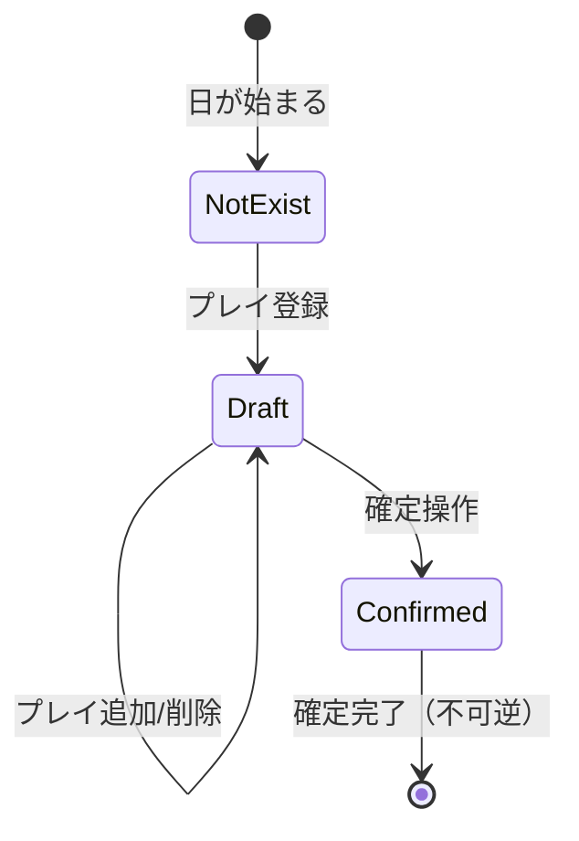
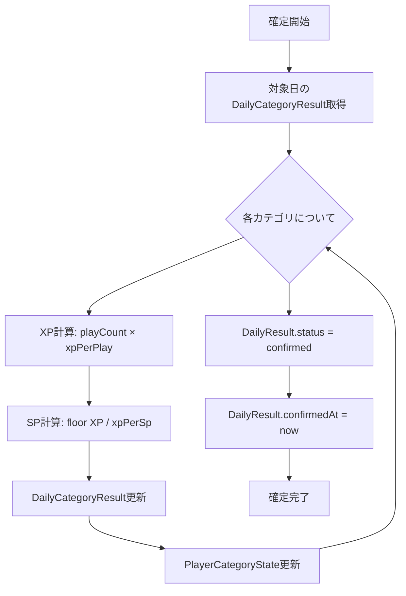
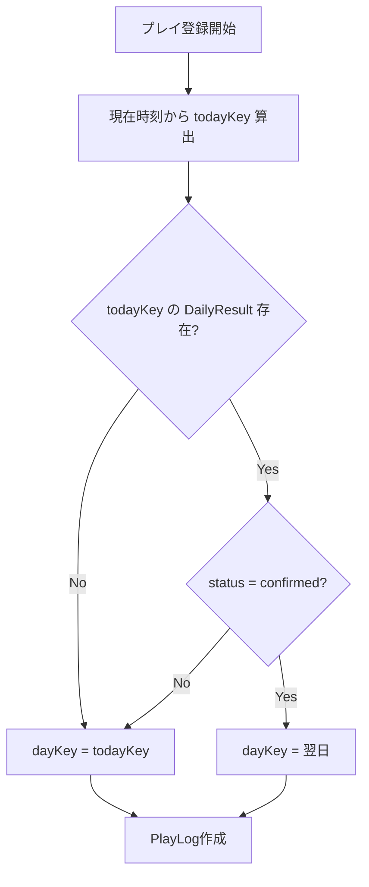
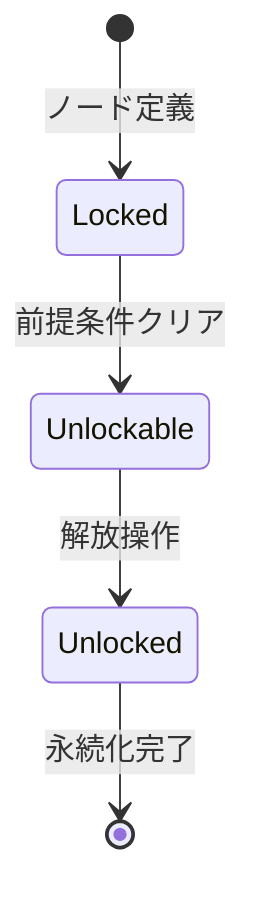
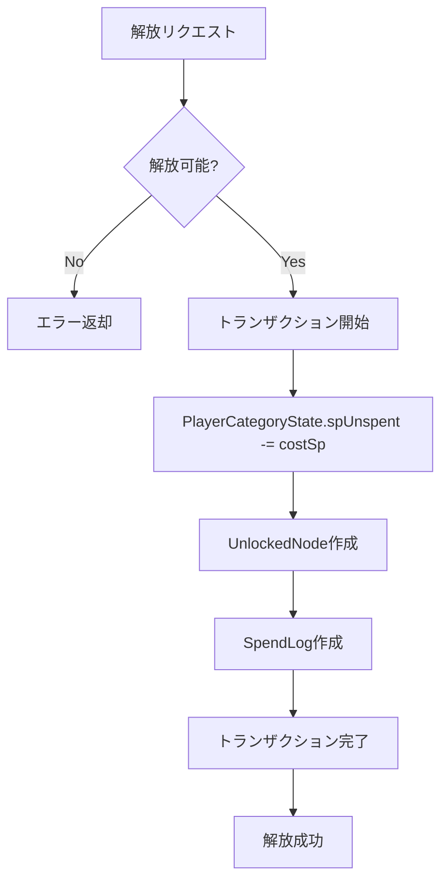
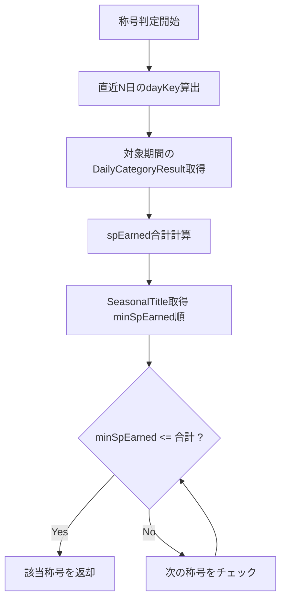

# State Machine

本ドキュメントは、Life Game RPG のコアとなる状態遷移ロジックを定義する。

---

## 1. DailyResult 状態遷移

### 状態図



### 状態定義

| 状態 | status値 | 説明 |
|------|----------|------|
| NotExist | - | DailyResultレコード未作成。プレイ未登録の日。 |
| Draft | "draft" | プレイ登録済み。確定前。編集可能。 |
| Confirmed | "confirmed" | 確定済み。XP/SP反映完了。編集不可。 |

### 遷移条件

| From | To | トリガー | 条件 | 副作用 |
|------|-----|---------|------|--------|
| NotExist | Draft | プレイ登録 | なし | DailyResult作成、DailyCategoryResult作成 |
| Draft | Draft | プレイ追加 | なし | DailyCategoryResult.playCount更新 |
| Draft | Draft | プレイ削除 | なし | DailyCategoryResult.playCount更新 |

**補足:** DailyResult.status が "confirmed" の日はプレイ削除不可。
| Draft | Confirmed | 確定操作 | なし | **確定処理フロー実行** |

---

## 2. 日次確定処理フロー

### 概要

「今日を確定する」操作により、その日のプレイが正式に反映される。
確定後は再計算不可（イミュータブル）。

### 処理ステップ



### 詳細処理（擬似コード）

```typescript
async function confirmDay(dayKey: string): Promise<void> {
  await prisma.$transaction(async (tx) => {
    // 1. DailyResult取得・検証
    const dailyResult = await tx.dailyResult.findUnique({
      where: { dayKey },
      include: { categoryResults: { include: { category: true } } },
    });

    if (!dailyResult) {
      throw new Error("DailyResult not found");
    }
    if (dailyResult.status === "confirmed") {
      throw new Error("Already confirmed");
    }

    // 2. 各カテゴリの集計処理
    for (const catResult of dailyResult.categoryResults) {
      const { category, playCount } = catResult;

      // XP/SP計算
      const xpEarned = playCount * category.xpPerPlay;
      const spEarned = Math.floor(xpEarned / category.xpPerSp);

      // DailyCategoryResult更新
      await tx.dailyCategoryResult.update({
        where: { id: catResult.id },
        data: { xpEarned, spEarned },
      });

      // PlayerCategoryState更新
      await tx.playerCategoryState.upsert({
        where: { categoryId: category.id },
        create: {
          categoryId: category.id,
          xpTotal: xpEarned,
          spUnspent: spEarned,
        },
        update: {
          xpTotal: { increment: xpEarned },
          spUnspent: { increment: spEarned },
        },
      });
    }

    // 3. DailyResult確定
    await tx.dailyResult.update({
      where: { dayKey },
      data: {
        status: "confirmed",
        confirmedAt: new Date(),
      },
    });
  });
}
```

### 計算式

| 項目 | 計算式 | 例（xpPerPlay=10, xpPerSp=20） |
|------|--------|-------------------------------|
| xpEarned | `playCount × category.xpPerPlay` | 3プレイ → 30XP |
| spEarned | `Math.floor(xpEarned / category.xpPerSp)` | 30XP → 1SP |

**端数処理:** 切り捨て（詳細は [open-questions.md](./open-questions.md) OQ-01参照）

---

## 3. 確定後プレイの翌日回し

### 概要

確定後に登録されたプレイは、翌日分として扱う。
これにより「やり直し」の誘惑を排除し、日次確定の意味を保つ。

### 判定フロー



### 実装コード

```typescript
async function registerPlay(actionId: string, note?: string): Promise<PlayLog> {
  const now = new Date();
  const todayKey = formatDayKey(now); // "YYYY-MM-DD"

  // 今日のDailyResultを確認
  const todayResult = await prisma.dailyResult.findUnique({
    where: { dayKey: todayKey },
  });

  // 確定済みなら翌日扱い
  const targetDayKey =
    todayResult?.status === "confirmed"
      ? getNextDayKey(todayKey)
      : todayKey;

  // PlayLog作成
  const playLog = await prisma.playLog.create({
    data: {
      at: now,           // 実際の登録時刻
      dayKey: targetDayKey, // 論理的な所属日
      actionId,
      note,
    },
  });

  // DailyResult・DailyCategoryResultの更新/作成
  await ensureDailyResultExists(targetDayKey);
  await updateCategoryResult(targetDayKey, actionId);

  return playLog;
}
```

### フィールドの意味

| フィールド | 値 | 説明 |
|------------|-----|------|
| PlayLog.at | 実際の登録時刻 | 23:30に登録 → "2026-01-19T23:30:00" |
| PlayLog.dayKey | 論理的な所属日 | 確定済みなら翌日 → "2026-01-20" |

---

## 4. タイムゾーン考慮

### Phase 1 方針

- サーバー側で固定タイムゾーン（JST: Asia/Tokyo）を使用
- `dayKey` は JST 基準で算出
- クライアントのタイムゾーンは考慮しない

### dayKey算出ロジック

**Phase 1 実装（シンプル版）:**

```typescript
// 非推奨: 手動オフセット計算
// const jstDate = new Date(date.getTime() + 9 * 60 * 60 * 1000);

// 推奨: date-fns-tz を使用
import { formatInTimeZone } from 'date-fns-tz';

function formatDayKey(date: Date): string {
  return formatInTimeZone(date, 'Asia/Tokyo', 'yyyy-MM-dd');
}

function getNextDayKey(dayKey: string): string {
  const date = new Date(dayKey + 'T00:00:00+09:00');
  date.setDate(date.getDate() + 1);
  return formatInTimeZone(date, 'Asia/Tokyo', 'yyyy-MM-dd');
}
```

**依存パッケージ:**

```bash
npm install date-fns date-fns-tz
```

**採用理由:**
- 標準的なタイムゾーン処理
- 将来のマルチタイムゾーン対応への拡張性
- エッジケース（日付境界）の正確な処理

### 将来拡張（OQ-03）

- ユーザー設定でタイムゾーンを指定可能に
- `dayKey` 算出時にユーザーのタイムゾーンを使用
- 既存データのマイグレーション戦略が必要

---

## 5. SkillNode 解放の状態遷移

### 状態図



### 状態定義

| 状態 | 条件 | 説明 |
|------|------|------|
| Locked | 前提ノード未解放 または SP不足 | 解放不可。グレーアウト表示。 |
| Unlockable | 前提ノード解放済み かつ SP >= costSp | 解放可能。ハイライト表示。 |
| Unlocked | UnlockedNode レコード存在 | 解放済み。称号取得。 |

### 解放可能判定ロジック

```typescript
async function canUnlock(nodeId: string): Promise<{
  canUnlock: boolean;
  reason?: string;
}> {
  const node = await prisma.skillNode.findUnique({
    where: { id: nodeId },
    include: {
      tree: { include: { category: { include: { playerState: true } } } },
      unlockedNodes: true,
    },
  });

  if (!node) {
    return { canUnlock: false, reason: "Node not found" };
  }

  // 既に解放済み
  if (node.unlockedNodes.length > 0) {
    return { canUnlock: false, reason: "Already unlocked" };
  }

  const playerState = node.tree.category.playerState;
  if (!playerState) {
    return { canUnlock: false, reason: "Player state not found" };
  }

  // SP不足
  if (playerState.spUnspent < node.costSp) {
    return {
      canUnlock: false,
      reason: `Insufficient SP: need ${node.costSp}, have ${playerState.spUnspent}`,
    };
  }

  // order=1 なら無条件で解放可能
  if (node.order === 1) {
    return { canUnlock: true };
  }

  // 前のノードが解放済みか確認
  const prevNode = await prisma.skillNode.findUnique({
    where: {
      treeId_order: {
        treeId: node.treeId,
        order: node.order - 1,
      },
    },
    include: { unlockedNodes: true },
  });

  if (!prevNode || prevNode.unlockedNodes.length === 0) {
    return { canUnlock: false, reason: "Previous node not unlocked" };
  }

  return { canUnlock: true };
}
```

### 解放処理フロー



### 解放処理コード

```typescript
async function unlockNode(nodeId: string): Promise<void> {
  const { canUnlock, reason } = await canUnlock(nodeId);
  if (!canUnlock) {
    throw new Error(reason);
  }

  await prisma.$transaction(async (tx) => {
    const node = await tx.skillNode.findUnique({
      where: { id: nodeId },
      include: { tree: true },
    });

    // SP消費
    await tx.playerCategoryState.update({
      where: { categoryId: node.tree.categoryId },
      data: { spUnspent: { decrement: node.costSp } },
    });

    // 解放記録
    await tx.unlockedNode.create({
      data: { nodeId },
    });

    // 消費履歴
    await tx.spendLog.create({
      data: {
        categoryId: node.tree.categoryId,
        type: "unlock_node",
        costSp: node.costSp,
        refId: nodeId,
      },
    });
  });
}
```

---

## 6. 週ランク称号の判定

### 概要

直近 N 日間（`category.rankWindowDays`）で獲得した SP 合計により、
週ランク称号（SeasonalTitle）が自動判定される。

### 判定ロジック



### 実装コード

```typescript
async function getCurrentSeasonalTitle(
  categoryId: string
): Promise<SeasonalTitle | null> {
  const category = await prisma.category.findUnique({
    where: { id: categoryId },
    include: { seasonalTitles: { orderBy: { order: "desc" } } },
  });

  if (!category) return null;

  // 直近N日のdayKeyリスト生成
  const dayKeys = getRecentDayKeys(category.rankWindowDays);

  // 対象期間のSP合計を取得
  const result = await prisma.dailyCategoryResult.aggregate({
    where: {
      categoryId,
      dayKey: { in: dayKeys },
      dailyResult: { status: "confirmed" },
    },
    _sum: { spEarned: true },
  });

  const totalSpEarned = result._sum.spEarned ?? 0;

  // 条件を満たす最高ランクを返却
  for (const title of category.seasonalTitles) {
    if (title.minSpEarned <= totalSpEarned) {
      return title;
    }
  }

  return null;
}

function getRecentDayKeys(days: number): string[] {
  const result: string[] = [];
  const today = new Date();

  for (let i = 0; i < days; i++) {
    const date = new Date(today);
    date.setDate(date.getDate() - i);
    result.push(formatDayKey(date));
  }

  return result;
}
```

### 特性

| 特性 | 説明 |
|------|------|
| 自動判定 | ユーザー操作なしで毎回計算 |
| 変動型 | やれば上がる、サボれば下がる |
| SP消費無関係 | 獲得SP（spEarned）のみで判定、未使用SP残高は無関係 |
| 確定済みのみ | status="confirmed" のDailyCategoryResultのみ対象 |

### 例：健康カテゴリ（rankWindowDays=7）

| 直近7日SP合計 | 称号 |
|---------------|------|
| 0〜2 | ビギナー |
| 3〜6 | アクティブ |
| 7〜13 | ストイック |
| 14〜20 | アスリート |
| 21以上 | レジェンド |

---

## 7. エッジケース一覧

### 日次確定関連

| ケース | 対応 |
|--------|------|
| プレイ0件の日を確定 | 許可。DailyResultはconfirmedになるが、SP/XPは0。 |
| 同一日の二重確定 | エラー。"Already confirmed" |
| 存在しない日の確定 | エラー。"DailyResult not found" |
| 確定済み日へのプレイ追加 | 翌日扱い（セクション3参照） |
| 日付を跨いで未確定のまま放置 | 問題なし。後から確定可能。 |

### SkillNode解放関連

| ケース | 対応 |
|--------|------|
| SP不足で解放試行 | エラー。"Insufficient SP" |
| 前提ノード未解放で解放試行 | エラー。"Previous node not unlocked" |
| 同一ノードの二重解放 | エラー。"Already unlocked"（@@uniqueでもDB保護） |
| ツリーの途中ノードを飛ばして解放 | 不可。一本道強制。 |

### 週ランク称号関連

| ケース | 対応 |
|--------|------|
| プレイ履歴0件 | 最低ランク（minSpEarned=0の称号）を返却 |
| SeasonalTitle未定義のカテゴリ | null を返却 |
| 期間中の確定日が一部のみ | 確定済みの日のみ集計 |

### データ整合性関連

| ケース | 対応 |
|--------|------|
| Category非表示化 | `visible=false` で論理削除。データは保持され振り返り可能。 |
| Category物理削除（非推奨） | Cascade削除でPlayLog等も消失。Phase 1では提供しない。 |
| SPがマイナスになる操作 | トランザクション内でチェック。ロールバック。 |
| 同時に複数解放操作 | トランザクションで排他制御 |

---

## 8. トランザクション境界

### 日次確定

```
BEGIN TRANSACTION
  ├── FOR EACH categoryResult
  │   ├── UPDATE DailyCategoryResult (xpEarned, spEarned)
  │   └── UPSERT PlayerCategoryState
  ├── UPDATE DailyResult (status, confirmedAt)
COMMIT
```

### ノード解放

```
BEGIN TRANSACTION
  ├── CHECK canUnlock
  ├── UPDATE PlayerCategoryState (spUnspent -= costSp)
  ├── INSERT UnlockedNode
  ├── INSERT SpendLog
COMMIT
```

### プレイ登録

```
BEGIN TRANSACTION
  ├── INSERT PlayLog
  ├── UPSERT DailyResult
  ├── UPSERT DailyCategoryResult
  ├── CREATE relation PlayLog <-> DailyCategoryResult
COMMIT
```

---

## 更新履歴

| 日付 | 更新内容 |
|------|----------|
| 2026-01-19 | 初版作成 |
