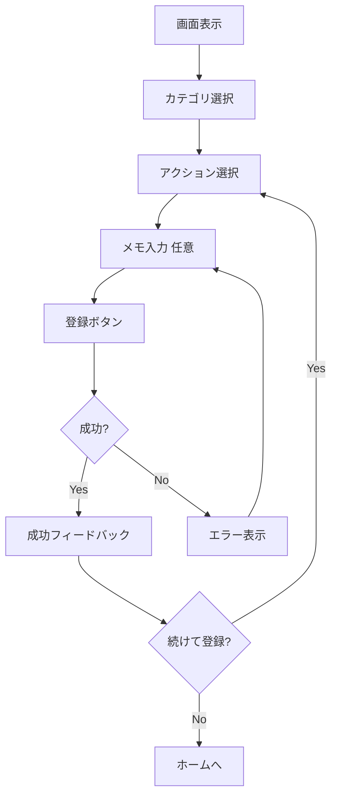
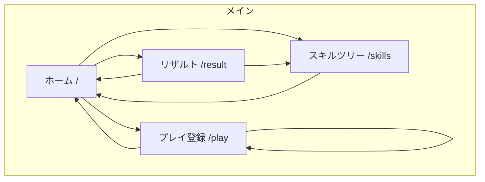

# UX Specification

本ドキュメントは、Life Game RPG のユーザー体験設計を定義する。
Phase 1 における最小限のUI要件と、実装者が迷わず着手できるレベルの詳細を記載する。

---

## 1. 設計原則

spec の設計思想に基づく UX 原則:

| 原則 | 説明 | 実装指針 |
|------|------|----------|
| 即時フィードバック | 行動が即座に反映される感覚 | プレイ登録時に未確定XPをすぐ表示 |
| 触りたくなる | 継続より「触りたい」を優先 | ゲーミフィケーション要素、達成感の演出 |
| 状態の可視化 | 「何をしたか」より「今どこにいるか」 | 週ランク称号、スキルツリーの進捗 |
| 失敗のない設計 | 停滞は失敗ではなく変動 | ランクダウンを否定的に見せない |

---

## 2. 画面構成（Phase 1）

### 2.1 必須画面一覧

| 画面 | パス | 優先度 | 説明 |
|------|------|--------|------|
| ホーム | `/` | P0 | ダッシュボード、今日の進捗 |
| プレイ登録 | `/play` | P0 | カテゴリ→アクション選択→登録 |
| リザルト | `/result` | P0 | 今日のプレイ一覧、確定ボタン |
| スキルツリー | `/skills` | P0 | カテゴリ別ツリー表示、ノード解放 |

### 2.2 Phase 1 スコープ外

| 画面 | 理由 |
|------|------|
| 設定画面 | カテゴリ/アクション編集は Phase 2 |
| 履歴画面 | 過去リザルト閲覧は Phase 2 |
| 統計画面 | 詳細分析は Phase 2 |

---

## 3. 画面別詳細仕様

### 3.1 ホーム画面（`/`）

#### 目的
- 今日の進捗を一目で把握
- 次のアクションへの導線

#### 必須表示項目

| 項目 | データソース | 表示形式 |
|------|-------------|----------|
| 今日の日付 | システム日付 | "2026年1月19日（日）" |
| 今日のプレイ数 | PlayLog.count(dayKey=today) | "今日のプレイ: 3回" |
| 未確定XP合計 | Σ(playCount × xpPerPlay) | "+30 XP（未確定）" |
| 確定状態 | DailyResult.status | "未確定" / "確定済み" バッジ |
| カテゴリ別サマリー | 各カテゴリ | カード形式で一覧 |

#### カテゴリ別サマリーカード

| 項目 | 表示形式 |
|------|----------|
| カテゴリ名 | "健康" |
| 今日のプレイ数 | "2回" |
| 未確定XP | "+20 XP" |
| 累計XP | "累計: 150 XP" |
| 未使用SP | "SP: 5" |
| 週ランク称号 | "アクティブ" バッジ |

#### アクションボタン

| ボタン | 遷移先 | 表示条件 |
|--------|--------|----------|
| プレイを記録する | `/play` | 常時 |
| 今日を確定する | `/result` | 未確定時のみ強調 |
| スキルツリー | `/skills` | 常時 |

#### ワイヤーフレーム

```
┌─────────────────────────────────────┐
│  2026年1月19日（日）    [未確定]    │
├─────────────────────────────────────┤
│                                     │
│  今日のプレイ: 3回                  │
│  +30 XP（未確定）                   │
│                                     │
│  [プレイを記録する]  [今日を確定]   │
│                                     │
├─────────────────────────────────────┤
│  ▼ カテゴリ別                       │
│  ┌─────────────────────────────┐   │
│  │ 健康           アクティブ   │   │
│  │ 2回 / +20 XP                │   │
│  │ 累計: 150 XP / SP: 5        │   │
│  └─────────────────────────────┘   │
│  ┌─────────────────────────────┐   │
│  │ 資格・学習                   │   │
│  │ 1回 / +10 XP                │   │
│  │ 累計: 80 XP / SP: 2         │   │
│  └─────────────────────────────┘   │
│                                     │
│  [スキルツリーを見る]               │
└─────────────────────────────────────┘
```

---

### 3.2 プレイ登録画面（`/play`）

#### 目的
- 素早くプレイを記録
- 最小限のステップで完了

#### フロー



#### 必須表示項目

**Step 1: カテゴリ選択**

| 項目 | 表示形式 |
|------|----------|
| カテゴリ一覧 | 大きめのボタン/カード |
| カテゴリ名 | "健康" |
| 今日のプレイ数 | "(今日: 2回)" |

**Step 2: アクション選択**

| 項目 | 表示形式 |
|------|----------|
| 選択中カテゴリ | 上部にパンくず表示 |
| アクション一覧 | リスト形式 |
| アクションラベル | "筋トレ（上半身）" |

**Step 3: メモ入力**

| 項目 | 表示形式 |
|------|----------|
| アクション名 | 確認表示 |
| メモ欄 | テキストエリア（任意） |
| プレビュー | "+10 XP（未確定）" |

#### 登録成功時フィードバック

| 項目 | 表示 |
|------|------|
| メッセージ | "プレイを記録しました！" |
| 獲得XP | "+10 XP" |
| アニメーション | シンプルなチェックマーク |
| 次のアクション | "続けて登録" / "ホームへ戻る" |

#### ワイヤーフレーム

```
┌─────────────────────────────────────┐
│  ← プレイを記録                     │
├─────────────────────────────────────┤
│                                     │
│  カテゴリを選んでください           │
│                                     │
│  ┌─────────────────────────────┐   │
│  │ 健康              (今日: 2) │   │
│  └─────────────────────────────┘   │
│  ┌─────────────────────────────┐   │
│  │ 資格・学習        (今日: 1) │   │
│  └─────────────────────────────┘   │
│                                     │
└─────────────────────────────────────┘

        ↓ カテゴリ選択後 ↓

┌─────────────────────────────────────┐
│  ← 健康                             │
├─────────────────────────────────────┤
│                                     │
│  アクションを選んでください         │
│                                     │
│  ○ 筋トレ（上半身）                │
│  ○ 筋トレ（下半身）                │
│  ○ 有酸素運動（30分以上）          │
│  ○ ストレッチ                      │
│  ○ 早寝早起き                      │
│                                     │
└─────────────────────────────────────┘

        ↓ アクション選択後 ↓

┌─────────────────────────────────────┐
│  ← 確認                             │
├─────────────────────────────────────┤
│                                     │
│  健康 > 筋トレ（上半身）            │
│                                     │
│  メモ（任意）                       │
│  ┌─────────────────────────────┐   │
│  │                             │   │
│  └─────────────────────────────┘   │
│                                     │
│  +10 XP（未確定）                   │
│                                     │
│  [記録する]                         │
│                                     │
└─────────────────────────────────────┘
```

---

### 3.3 リザルト画面（`/result`）

#### 目的
- 今日のプレイを振り返る
- 日次確定の意思決定

#### 必須表示項目

| 項目 | データソース | 表示形式 |
|------|-------------|----------|
| 今日の日付 | システム日付 | "2026年1月19日" |
| 確定状態 | DailyResult.status | ステータスバッジ |
| 合計プレイ数 | Σ playCount | "合計: 5回" |
| 合計XP | Σ xpEarned | "合計: 50 XP" |
| 合計SP（見込み） | Σ floor(xpEarned/xpPerSp) | "獲得予定: 2 SP" |
| カテゴリ別内訳 | DailyCategoryResult | 表形式 |
| プレイログ一覧 | PlayLog | 時系列リスト |

#### カテゴリ別内訳テーブル

| カテゴリ | プレイ数 | XP | SP |
|----------|----------|-----|-----|
| 健康 | 3回 | 30 XP | 1 SP |
| 資格・学習 | 2回 | 20 XP | 1 SP |
| **合計** | **5回** | **50 XP** | **2 SP** |

#### 確定ボタン

| 状態 | ボタン表示 | 動作 |
|------|------------|------|
| draft | "今日を確定する" (有効) | 確定処理実行 |
| draft（プレイ0件） | "今日を確定する" (有効) | 確定処理実行（XP/SP=0） |
| confirmed | "確定済み" (無効) | 何もしない |

#### 確定確認ダイアログ

```
┌─────────────────────────────────────┐
│  今日を確定しますか？               │
├─────────────────────────────────────┤
│                                     │
│  確定すると、以下が反映されます:    │
│                                     │
│  ・健康: +30 XP, +1 SP              │
│  ・資格・学習: +20 XP, +1 SP        │
│                                     │
│  ※確定後の変更はできません         │
│                                     │
│  [キャンセル]        [確定する]     │
└─────────────────────────────────────┘
```

#### 確定成功後表示

| 項目 | 表示 |
|------|------|
| メッセージ | "確定しました！" |
| 獲得SP | "+2 SP 獲得！" |
| 次のアクション | "スキルツリーを見る" / "ホームへ" |

#### ワイヤーフレーム

```
┌─────────────────────────────────────┐
│  ← 今日のリザルト       [未確定]    │
├─────────────────────────────────────┤
│                                     │
│  2026年1月19日                      │
│                                     │
│  ┌─────────────────────────────┐   │
│  │ 合計: 5回 / 50 XP / 2 SP    │   │
│  └─────────────────────────────┘   │
│                                     │
│  ▼ カテゴリ別内訳                   │
│  ┌─────┬─────┬─────┬─────┐        │
│  │     │回数 │ XP  │ SP  │        │
│  ├─────┼─────┼─────┼─────┤        │
│  │健康 │ 3   │ 30  │ 1   │        │
│  │資格 │ 2   │ 20  │ 1   │        │
│  └─────┴─────┴─────┴─────┘        │
│                                     │
│  ▼ プレイログ                       │
│  10:30  健康 > 筋トレ（上半身）     │
│  14:00  健康 > ストレッチ           │
│  15:30  資格 > 問題演習             │
│  ...                                │
│                                     │
│  [今日を確定する]                   │
│                                     │
└─────────────────────────────────────┘
```

---

### 3.4 スキルツリー画面（`/skills`）

#### 目的
- 成長の可視化
- ノード解放による達成感

#### 必須表示項目

| 項目 | データソース | 表示形式 |
|------|-------------|----------|
| カテゴリ選択 | Category[] | タブまたはドロップダウン |
| 未使用SP | PlayerCategoryState.spUnspent | "SP: 5" |
| 週ランク称号 | getCurrentSeasonalTitle() | "現在のランク: アクティブ" |
| ツリー表示 | SkillTree + SkillNode | ノード連結図 |
| ノード状態 | UnlockedNode | Locked/Unlockable/Unlocked |

#### ノード表示

| 状態 | 見た目 | 操作 |
|------|--------|------|
| Locked | グレー、半透明 | タップで詳細表示（解放不可） |
| Unlockable | ハイライト、パルス | タップで解放確認 |
| Unlocked | カラー、チェックマーク | タップで詳細表示 |

#### ノード詳細（タップ時）

```
┌─────────────────────────────────────┐
│  習慣化の兆し                       │
├─────────────────────────────────────┤
│                                     │
│  解放コスト: 3 SP                   │
│  あなたのSP: 5 SP                   │
│                                     │
│  [解放する]                         │
│                                     │
└─────────────────────────────────────┘
```

#### 解放成功フィードバック

| 項目 | 表示 |
|------|------|
| メッセージ | "称号を獲得！" |
| 称号名 | "習慣化の兆し" |
| 消費SP | "-3 SP" |
| 残りSP | "残りSP: 2" |

#### ワイヤーフレーム

```
┌─────────────────────────────────────┐
│  ← スキルツリー                     │
├─────────────────────────────────────┤
│  [健康]  [資格・学習]               │
├─────────────────────────────────────┤
│                                     │
│  SP: 5                              │
│  現在のランク: アクティブ           │
│                                     │
│  ─── 健康マスター ───               │
│                                     │
│     [✓] 健康への目覚め              │
│        │                            │
│     [★] 習慣化の兆し    ← 解放可能 │
│        │                            │
│     [○] 継続する者                  │
│        │                            │
│     [○] 健康の番人                  │
│        │                            │
│     [○] 健康マスター                │
│                                     │
│  凡例: [✓]解放済 [★]解放可 [○]未解放│
│                                     │
└─────────────────────────────────────┘
```

---

## 4. インタラクション設計

### 4.1 タッチ/クリック

| 操作 | 対象 | 動作 |
|------|------|------|
| タップ | カテゴリカード | 選択状態に変更 |
| タップ | アクションリスト項目 | 選択状態に変更 |
| タップ | 解放可能ノード | 解放確認ダイアログ |
| 長押し | プレイログ項目 | 削除オプション表示 |

### 4.2 ナビゲーション

| 操作 | 動作 |
|------|------|
| ← ボタン | 前の画面に戻る |
| ホームアイコン | ホーム画面へ |
| スワイプ（左右） | カテゴリ切り替え（スキルツリー） |

### 4.3 ローディング状態

| シーン | 表示 |
|--------|------|
| データ取得中 | スケルトンUI |
| 登録処理中 | ボタン無効化 + スピナー |
| 確定処理中 | オーバーレイ + プログレス |

### 4.4 エラー状態

| シーン | 表示 |
|--------|------|
| ネットワークエラー | トースト通知 + リトライボタン |
| バリデーションエラー | フィールド下に赤文字 |
| 処理失敗 | ダイアログでエラー内容表示 |

---

## 5. フィードバック設計

### 5.1 即時フィードバック

| アクション | フィードバック |
|------------|---------------|
| プレイ登録 | "+10 XP" が画面上部からフェードイン |
| 日次確定 | SP獲得数がポップアップ |
| ノード解放 | 称号名 + エフェクト |

### 5.2 状態表示

| 状態 | 表示方法 |
|------|----------|
| 未確定XP | 灰色またはイタリック + "(未確定)" |
| 確定済み | 緑色バッジ + チェックマーク |
| 解放可能ノード | パルスアニメーション |
| SP不足 | グレーアウト + 必要SP表示 |

### 5.3 進捗表示

| 対象 | 表示方法 |
|------|----------|
| スキルツリー進捗 | "2/5 解放済み" |
| 週ランク | 次ランクまでのSP "あと 3 SP で ストイック" |
| 累計XP | プログレスバー |

---

## 6. レスポンシブ対応

### 6.1 ブレークポイント

| サイズ | 幅 | 用途 |
|--------|-----|------|
| mobile | < 640px | スマートフォン |
| tablet | 640px - 1024px | タブレット |
| desktop | > 1024px | PC |

### 6.2 レイアウト変更

| 要素 | mobile | tablet/desktop |
|------|--------|----------------|
| ナビゲーション | 下部タブバー | サイドバー |
| カテゴリカード | 縦積み | グリッド（2列） |
| スキルツリー | 縦スクロール | 横配置 |

### 6.3 タッチターゲット

- 最小サイズ: 44px × 44px
- ボタン間隔: 8px 以上

---

## 7. アクセシビリティ要件

### 7.1 基本要件（Phase 1）

| 要件 | 対応 |
|------|------|
| キーボード操作 | フォーカス可能、Tab移動 |
| スクリーンリーダー | 意味のあるラベル、alt属性 |
| コントラスト比 | WCAG AA準拠（4.5:1以上） |
| フォントサイズ | 16px以上、拡大可能 |

### 7.2 ARIAラベル例

```html
<!-- プレイ登録ボタン -->
<button aria-label="プレイを記録する">
  プレイを記録
</button>

<!-- 解放可能ノード -->
<button
  aria-label="習慣化の兆し（解放可能、3SP必要）"
  aria-pressed="false"
>
  習慣化の兆し
</button>

<!-- 確定状態バッジ -->
<span role="status" aria-live="polite">
  未確定
</span>
```

---

## 8. MVPでやらないこと

Phase 1 では以下を明示的にスコープ外とする:

| カテゴリ | 除外項目 | 理由 |
|----------|----------|------|
| 演出 | アニメーション効果音 | シンプルさ優先 |
| 演出 | レベルアップ演出 | 後から追加可能 |
| 同期 | オフライン対応 | サーバー前提で実装 |
| 同期 | リアルタイム更新 | 複雑性回避 |
| アカウント | ログイン/認証 | シングルユーザー前提 |
| アカウント | データエクスポート | Phase 2 |
| 分析 | 詳細統計グラフ | Phase 2 |
| 分析 | 期間比較 | Phase 2 |
| カスタマイズ | カテゴリ/アクション編集 | Phase 2 |
| カスタマイズ | テーマ切り替え | Phase 2 |

---

## 9. 画面遷移図



---

## 10. コンポーネント設計（参考）

### 共通コンポーネント

| コンポーネント | 用途 |
|---------------|------|
| `Button` | 各種ボタン |
| `Card` | カテゴリカード、サマリーカード |
| `Badge` | ステータス表示、称号表示 |
| `Dialog` | 確認ダイアログ |
| `Toast` | 通知表示 |
| `ProgressBar` | 進捗表示 |
| `Skeleton` | ローディング表示 |

### 画面固有コンポーネント

| 画面 | コンポーネント |
|------|---------------|
| Home | `CategorySummaryCard`, `TodayStats` |
| Play | `CategorySelector`, `ActionList`, `PlayForm` |
| Result | `ResultSummary`, `CategoryBreakdown`, `PlayLogList` |
| Skills | `SkillTreeView`, `SkillNode`, `SeasonalTitleBadge` |

---

## 更新履歴

| 日付 | 更新内容 |
|------|----------|
| 2026-01-19 | 初版作成 |
